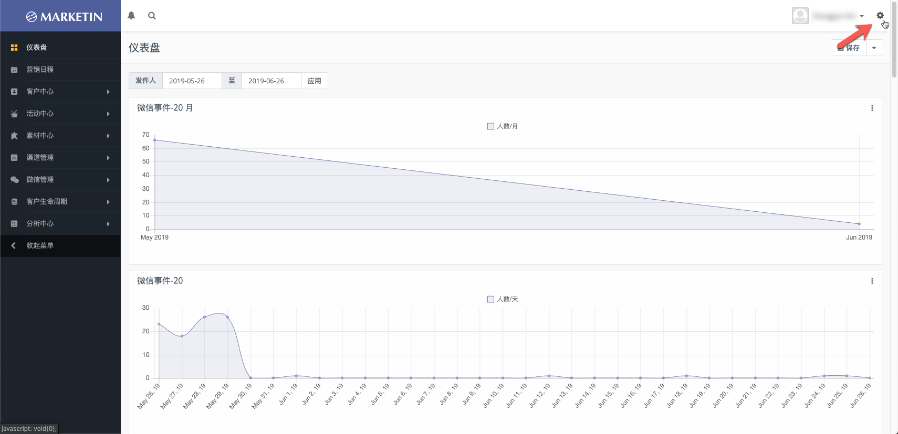
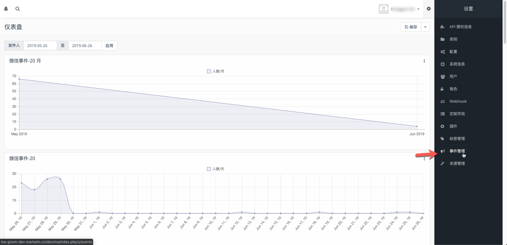
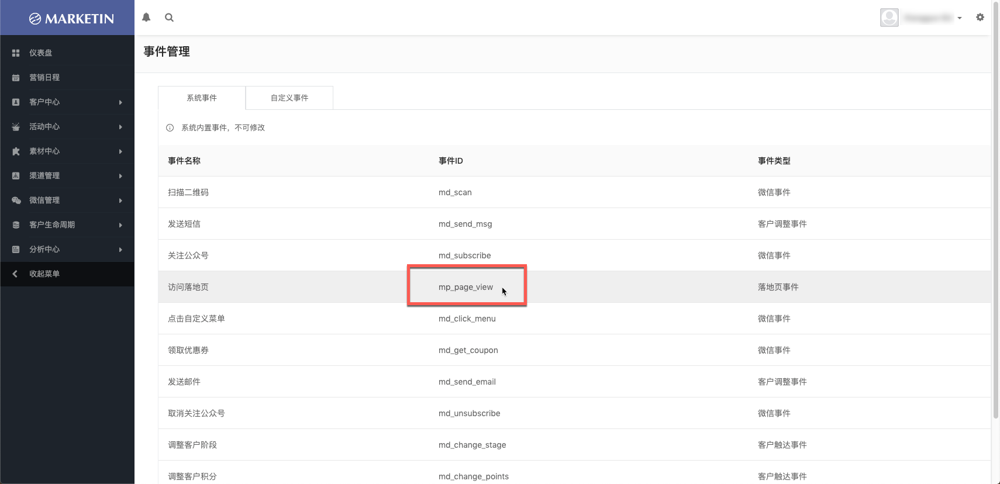
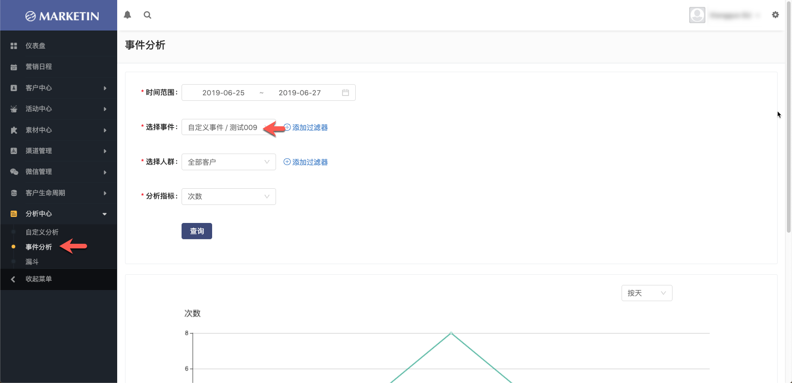
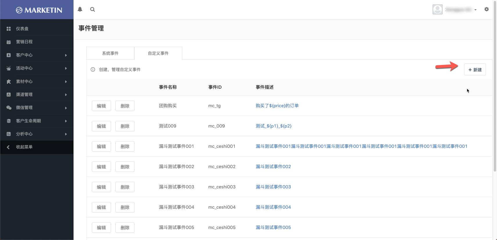
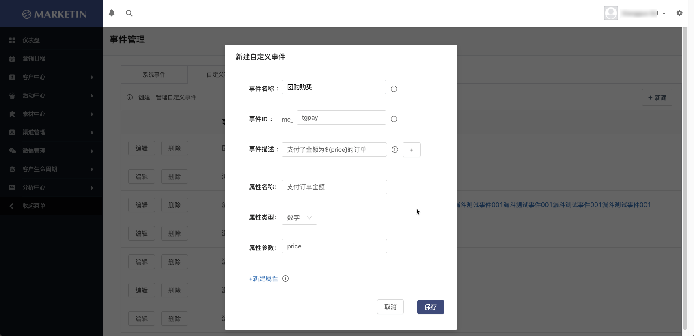
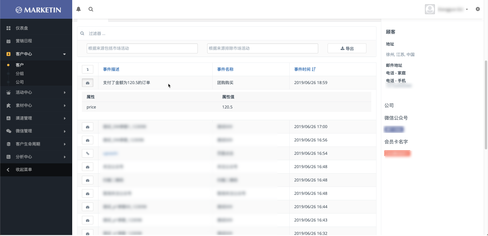

# 如何为页面事件打点并收集数据

本文档将让您了解如何完成打点并最终收到用户行为数据，阅读时间约5分钟

---
# 什么是事件打点？

打点是活动监测的常用功能，通过MA系统您可以轻松的完成打点布码，并查看到数据。打点代码布置后，您可以实时在MA系统中查看到数据。

如果您对文档中的代码部分不理解，可以将本文档链接转给负责您活动页面的开发人员由他们负责完成操作。

MA系统的打点事件分为两种：

    1. 系统事件：MA预置的一些常用打点事件，不能新建或修改
    
    2. 自定义事件：用户可自行添加的打点事件，可随时编辑

---
# 系统事件埋码操作步骤

## 1、找到MA系统事件对应的代码
打开系统事件列表，并找到您想要使用的事件

点击右上角的齿轮，如下图：


点击事件管理，如下图：


这里我们假设您想为自己的落地页的访问次数进行监控，您应该使用“访问落地页“事件。

找到“访问落地页”对应的事件ID，是mp_page_view，如下图：


每个系统事件都有不同的参数可以传，详见下表

事件名称|事件ID|参数1_类型|参数1_属性名称
-|-|-|-
访问落地页|mp_page_view|数字|pageId

## 2、将示例代码更改后嵌入页面代码中
首先设置您的环境：window.mkt = new Mkt("production"); 

>production代表线上正式环境，如果需要使用其他环境请与marketin技术人员沟通。

打点代码格式为：mkt.event.log(EVENT_ID, LEAD_ID, OPEN_ID, PROPERTIES)，log的具体参数说明如下：

参数|类型|说明
-|-|-
EVENT_ID|String|事件ID，必填
LEAD_ID|Number|会员ID，选填
OPEN_ID|String|会员在微信中，关注公众号后对应的open_id，非必填
PROPERTIES|json|事件的属性，非必填（请注意json内的数据格式确保正确）

代码示例
```js
<script src="ma-jssdk/s+/mkt.js"></script> //mkt.js对应的地址
<script type="text/javascript">
		window.mkt = new Mkt("dev");
		mkt.event.log("mc_009","", "oAWiH1Pa0G7xKLiH7taoGOu00XXI", { "p1": "文本参数", "p2": 123098 });
	</script>
```
## 3、调用打点并到MA系统中检查数据变化
您可以到MA系统的事件分析中查看打点数据，以便确保埋码的准确性。

事件分析-选择对应的事件检查打点是否触发，如下图：


## 4、将页面发布
如果测试无问题，您可以将页面发布，并在活动期间正常收数。

---
# 自定义事件埋码操作步骤
与使用系统事件唯一不同的是，您需要自行创建自定义事件

事件管理中点击自定义事件、点击新建，如下图：


新建自定义事件时，您可以任意定义参数数量和名称。这些参数都将会显示在客户中心中。自定义事件的参数用于在触发打点上报时带入额外的字段进行说明。如：您要在用户完成
团购购买时触发打点，同时带入用户本次团购的金额，则可设置一个支付订单金额的参数，并在打点时将订单金额带入带这个参数中。

事件描述中可以添加触发的动态参数，如下图：


在客户详情中查看到的打点结果，如下图：
 

如果您还有其他问题，请发送邮件至pm@marketin.cn咨询。


